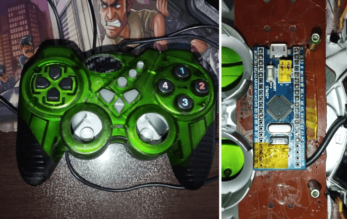
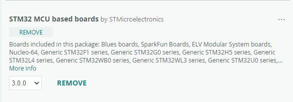
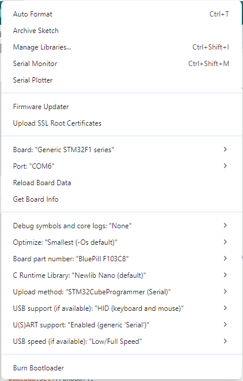
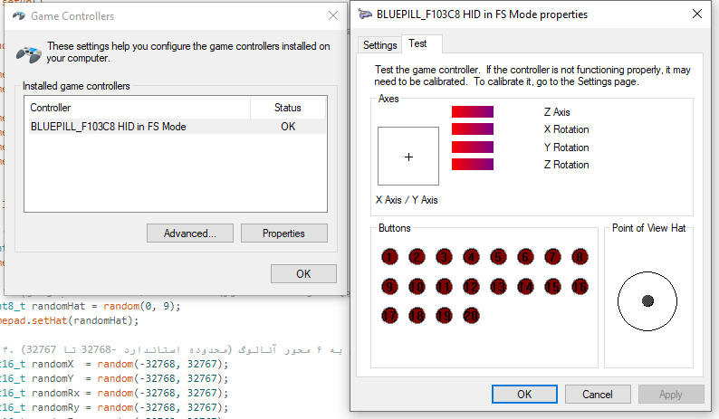
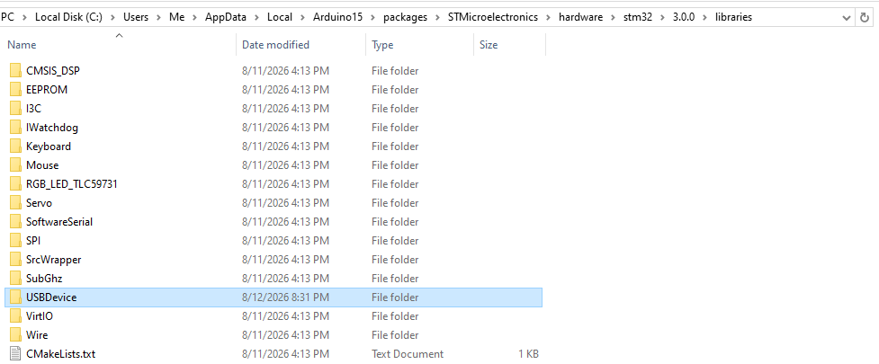

# 🎮 Guide to Install and Setup BluePill F103C8 as HID Gamepad

## 📌 Introduction
This document provides a complete guide to install and configure the **BluePill STM32F103C8** board as a **HID Game Controller** on Windows. By following this tutorial, your board will be recognized as a HID controller capable of sending Axes, Buttons, and POV Hat data.

---

## 🛠️ Prerequisites
- **BluePill F103C8** board
- USB cable (preferably micro USB with data transfer capability)
- **Arduino IDE** (version 2.3.8)
- Internet connection for installing required libraries and packages

---

## 📦 Installing Required Packages in Arduino IDE

### 1. Install STM32 Package
1. Open Arduino IDE.
2. Go to **File > Preferences**.
3. In the **Additional Boards Manager URLs** section, add the following URL:

https://github.com/stm32duino/BoardManagerFiles/raw/main/package_stmicroelectronics_index.json

4. Go to **Tools > Board > Boards Manager...**.
5. Search for **STM32** in the search box.
6. Find the package **STM32 MCU based boards by STMicroelectronics** and click **Install** (version 3.0.0 or higher).

### 2. Board Configuration in Arduino IDE
After installation, configure your board with the following settings:

| Setting | Value |
|---------|-------|
| **Board** | `Generic STM32F1 series` |
| **Board part number** | `BluePill F103C8` |
| **Upload method** | `STM32CubeProgrammer (Serial)` |
| **USB support** | `HID (keyboard and mouse)` |
| **U(S)ART support** | `Enabled (generic 'Serial')` |
| **USB speed** | `Low/Full Speed` |
| **Optimize** | `Smallest (-Os default)` |
| **C Runtime Library** | `Newlib Nano (default)` |
| **Port** | `COM6` OR ... |

---

## 🔌 Connecting the Board and Installing Drivers

### 1. Install STM32 Drivers
- For serial communication, install the **ST-Link** or **CH340** driver (depending on the USB-to-serial converter on your board).
- You can download the required drivers from:
- [ST-Link Driver](https://www.st.com/en/development-tools/st-link-v2.html)
- [CH340 Driver](http://www.wch.cn/download/CH341SER_EXE.html)

### 2. Board Detection in Windows
- Connect the board to your computer via USB cable.
- In Device Manager, a new COM port should appear (e.g., COM6).
- If you see an unknown device, install the appropriate driver.

---

## 🧪 Testing and Calibration

### 1. Open Game Controllers in Windows
- Press `Win + R` and type `joy.cpl`.
- Or go to Control Panel > Devices and Printers > Game Controllers.

### 2. View Controller
- In the list, you should see **BLUEPILL_F103C8 HID in FS Mode** with status **OK**.
- Click on it and select **Properties**.

### 3. Test Functionality
- In the **Settings** tab, test the following:
- **Axes**: `Z Axis`, `X Rotation`, `Y Rotation`, `Z Rotation`
- **Buttons**: 24 buttons (1 through 24)
- **Point of View Hat**: An 8-way switch

---

## 📂 STM32 Libraries Folder Structure

Path to installed libraries (after STM32 package installation):

C:\Users\XXXXXXX\AppData\Local\Arduino15\packages\STMicroelectronics\hardware\stm32\3.0.0\libraries\

---

## 📦 Custom USBDevice Library

### ⚠️ Important Note
**The current version of the STM32 package (3.0.0) only includes `Keyboard` and `Mouse` libraries for HID functionality. It does NOT include Gamepad/Joystick support by default.**

### 🆕 Custom Library Installation
I have written a custom **USBDevice** library that adds **Gamepad/Joystick** support to the BluePill. To use it:

1. **Download** the `USBDevice.rar` file from the Library Folder.
2. **Extract** the contents to the following path:

C:\Users\XXXXXXX\AppData\Local\Arduino15\packages\STMicroelectronics\hardware\stm32\3.0.0\libraries\

3. **Replace** the existing `USBDevice` folder if prompted.
4. **Restart** Arduino IDE.

After extraction, your `USBDevice` library will include Gamepad HID support, allowing you to use the board as a full-featured game controller with:
- Multiple axes
- Up to 32 buttons
- POV Hat switch
- Triggers and more

---
